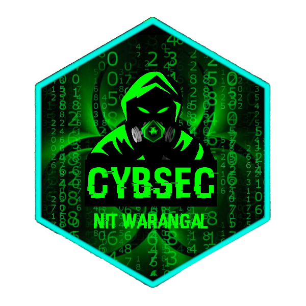

# [CybSec NITW](https://cybsec.in)

Built with React & ❤️ and hosted on Netlify. (Note: this site is _not_ compatible with GitHub Pages.)

## Content Structure

| Directory |  |
| --- | --- |
| ````src/```` | List of all the content used to build website, with assets inside of each folder. |

## Development Structure

| Directory |  |
| --- | --- |
| ````components/```` | Contents of < head >, nav bar, and footer., and additional components like sounds, animation, social links. To customize website in the structure modify this. |
| ````data/```` | In our website it is used for team data as json. It can be used as news or blog links, or list of events. |
| ````images/```` | All the static images present in website. |
| ````layouts/```` | Just a template, not so much important. |
| ````pages/```` |  All the nav bar pages source code. Can be modified easily, like error404, about, team pages. |
| ````settings/```` | set your sound and theme. Personalize here. |
| ````tools/```` | (Optional) This was made to place audio/video player in the site, not in use now. |


| File |  |
| --- | --- |
| ````package.json```` | All the dependencies which needs to be installed and meta tag too. |
| ````server.js```` | Server running script, currently set to development |

## To create a react project

When you install node, you will have npm and npx both, just be sure Node >8.10 and npm >=5.6

````bash
# create react app
hacker@linux : npx create-react-app app-name

hacker@linux : cd app-name

hacker@linux : npm start

````

## Running the site locally

Make sure you have nodejs & react installed, then...

````bash
# build website
hacker@linux : npm run build

# run server on localhost:14000. 
hacker@linux : npm run server
````

To know more, see package.json file -> scripts

\ ゜o゜)ノ

-- Groot


